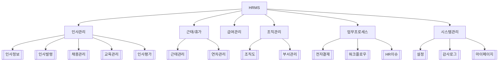

# HRMS 프로젝트 개요

## 프로젝트 정보

| 항목 | 내용 |
|------|------|
| 프로젝트명 | PANASIA HRMS (인사관리시스템) |
| 기술스택 | Next.js 16 + React 19 + TypeScript |
| UI | Tailwind CSS 4 + shadcn/ui + Radix UI |
| 상태관리 | Zustand 5 (영속 스토어) |
| 백엔드 | Supabase (현재 데모 데이터 기반) |
| 차트 | Recharts 3 |
| 폼 | React Hook Form + Zod |
| 테이블 | TanStack React Table |
| 검색 | Fuse.js (퍼지 검색) |
| 개발기간 | 2026-02-19 ~ 진행중 |

## 모듈 구성

## 메뉴 구조

| 메뉴 | 경로 | 설명 | 문서 링크 |
|------|------|------|-----------|
| 대시보드 | `/` | 종합 현황판 | [[대시보드]] |
| 마이페이지 | `/my` | 개인 정보 포털 | [[마이페이지]] |
| 조직도 | `/organization` | 조직 구조 시각화 | [[조직도]] |
| 인사정보 | `/employees` | 직원 관리 | [[인사정보 관리]] |
| 근태관리 | `/attendance` | 출퇴근 관리 | [[근태관리]] |
| 휴가관리 | `/leave` | 연차/휴가 관리 | [[연차관리]] |
| 급여관리 | `/payroll` | 급여 계산/지급 | [[급여관리]] |
| 인사발령 | `/appointments` | 발령 이력 | [[인사발령]] |
| 전자결재 | `/approval` | 결재 워크플로우 | [[전자결재]] |
| 채용관리 | `/recruitment` | 채용 프로세스 | [[채용관리]] |
| 교육관리 | `/training` | 교육 과정 | [[교육관리]] |
| 평가관리 | `/evaluation` | 인사 평가 | [[인사평가]] |
| 업무프로세스 | `/workflows` | 워크플로우 자동화 | [[워크플로우]] |
| HR이슈 | `/issues` | 이슈 트래킹 | [[HR이슈 관리]] |
| 감사로그 | `/audit-log` | 감사 추적 | [[감사로그]] |
| 설정 | `/settings` | 시스템 설정 | [[설정]] |
| 로그인 | `/login` | 인증/랜딩 | [[로그인]] |

## 인증 체계

- **AuthGuard**: 미인증 사용자 → `/login` 자동 리다이렉트
- **역할 기반 접근제어 (RBAC)**
  - `admin` - 시스템관리자 (전체 접근)
  - `hr_manager` - 인사담당자
  - `dept_manager` - 부서관리자
  - `employee` - 일반사원
- 메뉴별 역할 권한 설정 가능 ([[설정]] 참조)

## 데이터 저장소

모든 스토어는 [[Zustand 스토어]] 참조

## 관련 문서

- [[기술 아키텍처]]
- [[데이터 타입 정의]]
- [[Zustand 스토어]]
