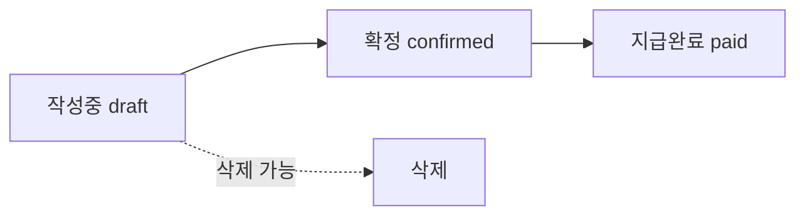

# 급여관리

> 경로: `/payroll`, `/payroll/calculate`, `/payroll/payslip` | 파일: `src/app/payroll/`

## 개요

임직원 급여를 계산하고, 명세서를 생성/발급하며, 지급 상태를 관리한다.

## 주요 기능

### 급여 현황 (`/payroll`)
- **요약 카드**: 총 지급액, 총 공제액, 실수령액
- **년/월 필터링**
- **급여 테이블**: 직원별 급여 상세
- **상태 전환**: 작성중 → 확정 → 지급완료
- **삭제**: 작성중 상태만 가능

### 급여 계산 (`/payroll/calculate`)
- 4대보험 자동 계산
- 소득세 계산
- 수당/공제 항목 관리

### 급여명세서 (`/payroll/payslip`)
- 개인별 명세서 조회
- 인쇄/출력 기능

## 급여 상태 흐름



## 급여 구성

### 지급 항목
- 기본급, 직무수당, 직책수당, 시간외수당, 식대, 교통비 등

### 공제 항목
- 국민연금, 건강보험, 장기요양보험, 고용보험, 소득세, 지방소득세

## 데이터 모델

```typescript
SavedPayroll {
  id: string
  employee_id: string
  year: number
  month: number
  base_salary: number
  total_earnings: number
  total_deductions: number
  net_pay: number
  status: 'draft' | 'confirmed' | 'paid'
}

PayrollLineItem {
  id: string
  payroll_id: string
  name: string
  amount: number
  type: 'earning' | 'deduction'
}
```

## 데이터 의존성

- [[Zustand 스토어#payroll-store|payroll-store]] → savedPayrolls, updatePayrollStatus, deletePayroll

## 관련 모듈

- [[인사정보 관리]] | [[근태관리]] | [[마이페이지]]
