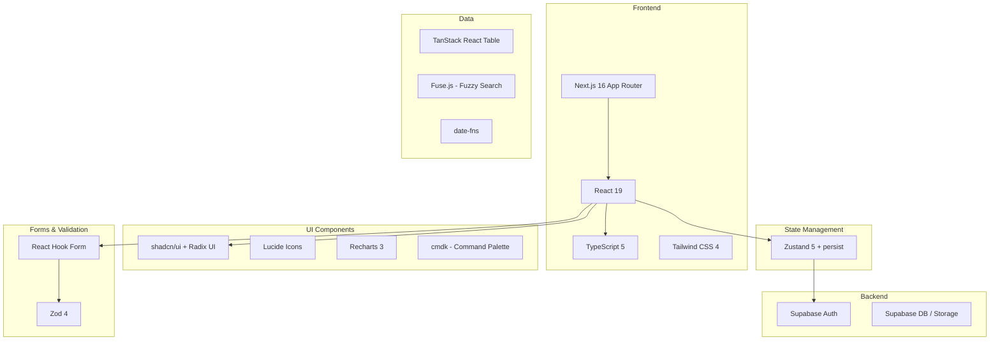
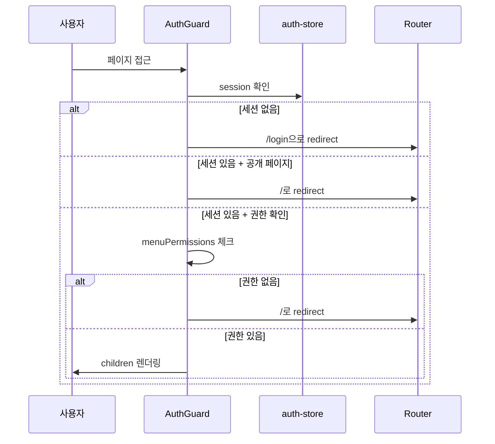

# 기술 아키텍처

## 기술 스택



## 디렉토리 구조

```
src/
├── app/                    # Next.js App Router 라우트
│   ├── layout.tsx          # 루트 레이아웃 (AuthGuard, Theme)
│   ├── page.tsx            # 대시보드
│   ├── login/              # 로그인/랜딩
│   ├── employees/          # 인사정보
│   ├── organization/       # 조직도
│   ├── attendance/         # 근태관리
│   ├── leave/              # 연차관리
│   ├── payroll/            # 급여관리
│   ├── appointments/       # 인사발령
│   ├── approval/           # 전자결재
│   ├── recruitment/        # 채용관리
│   ├── training/           # 교육관리
│   ├── evaluation/         # 인사평가
│   ├── workflows/          # 워크플로우
│   ├── issues/             # HR이슈
│   ├── audit-log/          # 감사로그
│   ├── my/                 # 마이페이지
│   └── settings/           # 설정
├── components/
│   ├── ui/                 # shadcn/ui 기본 컴포넌트
│   ├── layout/             # 레이아웃 (Sidebar, Header, AuthGuard 등)
│   └── dashboard/          # 대시보드 전용 컴포넌트
├── lib/
│   ├── stores/             # Zustand 스토어 (13개)
│   ├── supabase/           # Supabase 클라이언트
│   ├── constants/          # 메뉴, 상수
│   └── utils.ts            # 유틸리티
└── types/                  # TypeScript 타입 정의
```

## 인증 흐름



## 레이아웃 구조

```
RootLayout
├── ThemeProvider (다크/라이트 모드)
│   └── TooltipProvider
│       └── AuthGuard (인증 체크)
│           └── ConditionalLayout
│               ├── [/login] → children만 렌더 (Bare)
│               └── [기타] → Sidebar + Header + main + CommandPalette + HelpWorkflow
└── Toaster (알림 토스트)
```

## 관련 문서

- [[HRMS 프로젝트 개요]]
- [[Zustand 스토어]]
- [[데이터 타입 정의]]
