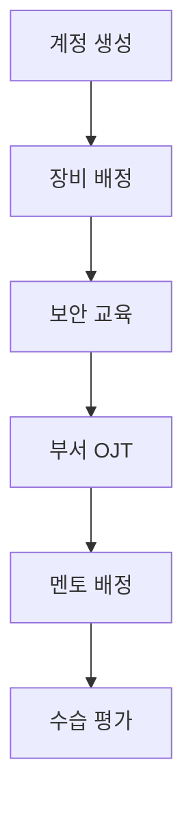

# 워크플로우

> 경로: `/workflows`, `/workflows/[id]` | 파일: `src/app/workflows/`

## 개요

입사/퇴사/승진/전보 등 정형화된 업무 프로세스를 템플릿으로 관리하고, 인스턴스를 생성하여 진행 상황을 추적한다.

## 주요 기능

- **인스턴스 관리**: 상태별 탭 (진행중 / 완료 / 전체)
- **프로세스 유형 필터**
- **새 프로세스 생성**: 템플릿 선택 + 직원 배정
- **진행 카드**: 단계별 체크리스트 시각화
- **상세** (`/workflows/[id]`): 태스크별 상태 관리

## 워크플로우 유형

| 유형 | 코드 | 설명 |
|------|------|------|
| 입사 | `onboarding` | 신입사원 온보딩 |
| 퇴사 | `offboarding` | 퇴사 절차 |
| 승진 | `promotion` | 승진 프로세스 |
| 전보 | `transfer` | 전보 프로세스 |
| 사용자정의 | `custom` | 기타 프로세스 |

## 데이터 모델

```typescript
WorkflowTemplate {
  id: string
  name: string
  type: WorkflowType
  is_active: boolean
  steps: WorkflowStep[]
}

WorkflowInstance {
  id: string
  template_id: string
  employee_id: string
  employee_name: string
  department: string
  status: 'in_progress' | 'completed' | 'cancelled'
  started_at: string
  completed_at?: string
  tasks: WorkflowTask[]
}

WorkflowTask {
  id: string
  instance_id: string
  step: number
  title: string
  status: 'pending' | 'in_progress' | 'completed' | 'skipped'
  assigned_to?: string
  due_date?: string
  completed_at?: string
}
```

## 프로세스 흐름 예시 (온보딩)



## 데이터 의존성

- [[Zustand 스토어#workflow-store|workflow-store]] → instances, templates, createInstance

## 관련 모듈

- [[전자결재]] | [[인사발령]] | [[설정]]
