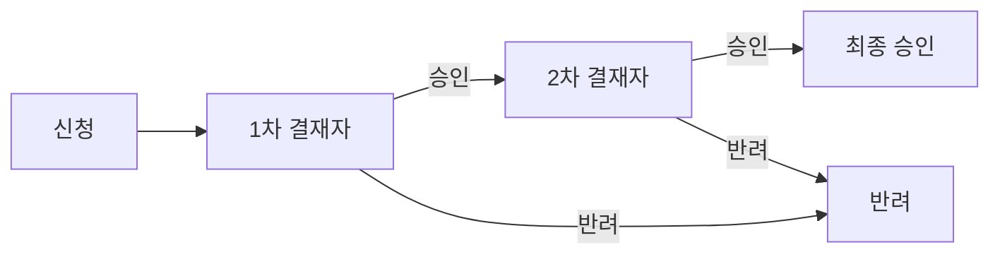

# 전자결재

> 경로: `/approval`, `/approval/[id]` | 파일: `src/app/approval/`

## 개요

휴가, 인사발령, 경비 등 결재 요청을 다단계 승인 라인으로 처리한다.

## 주요 기능

- **통계**: 전체, 대기, 승인, 반려 건수
- **탭 인터페이스**: 미결 / 완료
- **결재 상세** (`/approval/[id]`): 승인라인별 상태 추적
- 결재자 코멘트 기능

## 결재 유형

| 유형 | 코드 |
|------|------|
| 휴가 | `leave` |
| 인사발령 | `appointment` |
| 경비 | `expense` |
| 일반 | `general` |

## 결재 상태

| 상태 | 코드 | 설명 |
|------|------|------|
| 대기 | `pending` | 결재 대기 중 |
| 진행중 | `in_progress` | 결재 라인 진행 |
| 승인 | `approved` | 최종 승인 |
| 반려 | `rejected` | 반려 |
| 취소 | `cancelled` | 신청자 취소 |

## 데이터 모델

```typescript
Approval {
  id: string
  title: string
  type: 'leave' | 'appointment' | 'expense' | 'general'
  requester_id: string
  status: ApprovalStatus
  created_at: string
  approval_lines: ApprovalLine[]
}

ApprovalLine {
  id: string
  approval_id: string
  approver_id: string
  order: number          // 결재 순서
  status: 'pending' | 'approved' | 'rejected'
  decision?: string
  comment?: string
  decided_at?: string
}
```

## 결재 플로우



## 데이터 의존성

- [[Zustand 스토어#approval-store|approval-store]] → approvals
- [[Zustand 스토어#employee-store|employee-store]] → employees, departments

## 관련 모듈

- [[연차관리]] | [[인사발령]] | [[워크플로우]]
